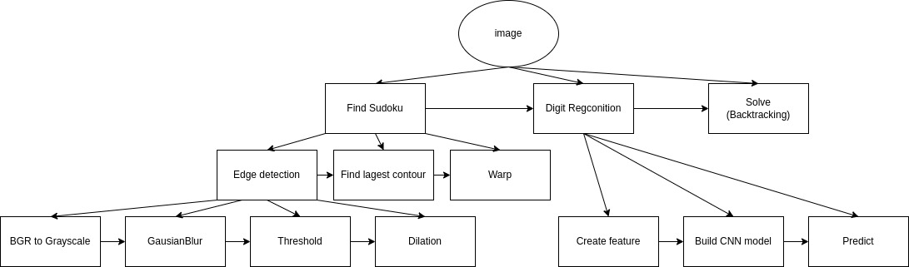

# Solve Sudoku using OpenCV, CNN and Backtracking
---

### Install packages
<pre>pip install -r requirements.txt </pre>

### Run

* Linux
<pre> python3 sudoku.py </pre>

### Result
* input

* ouput
